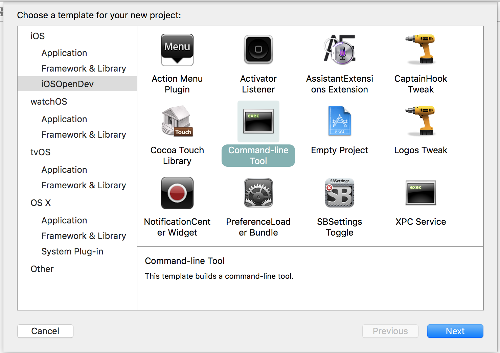
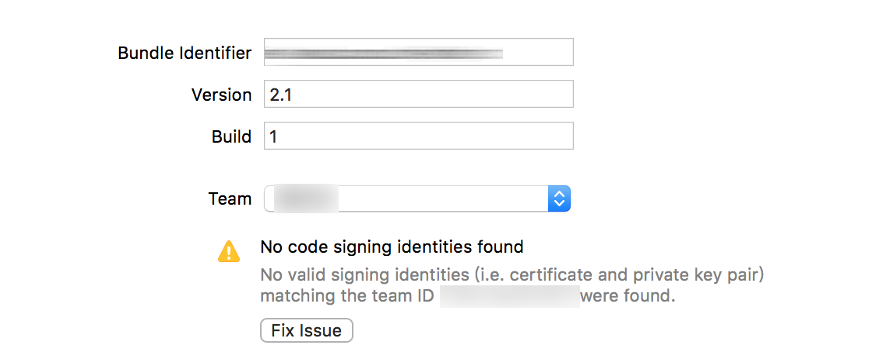
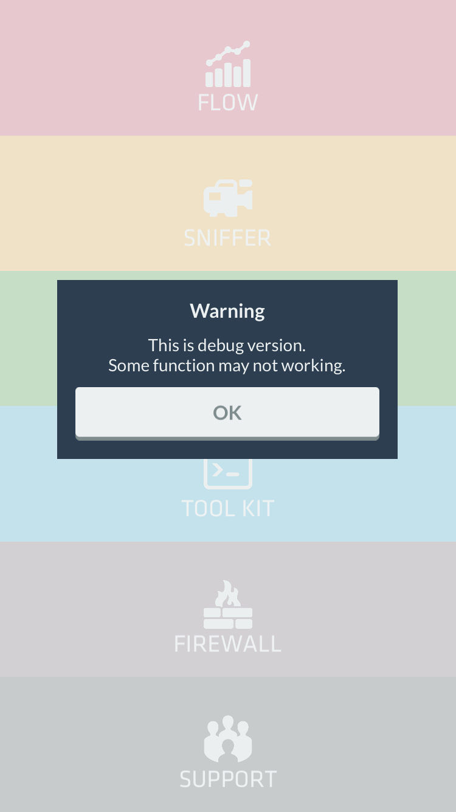
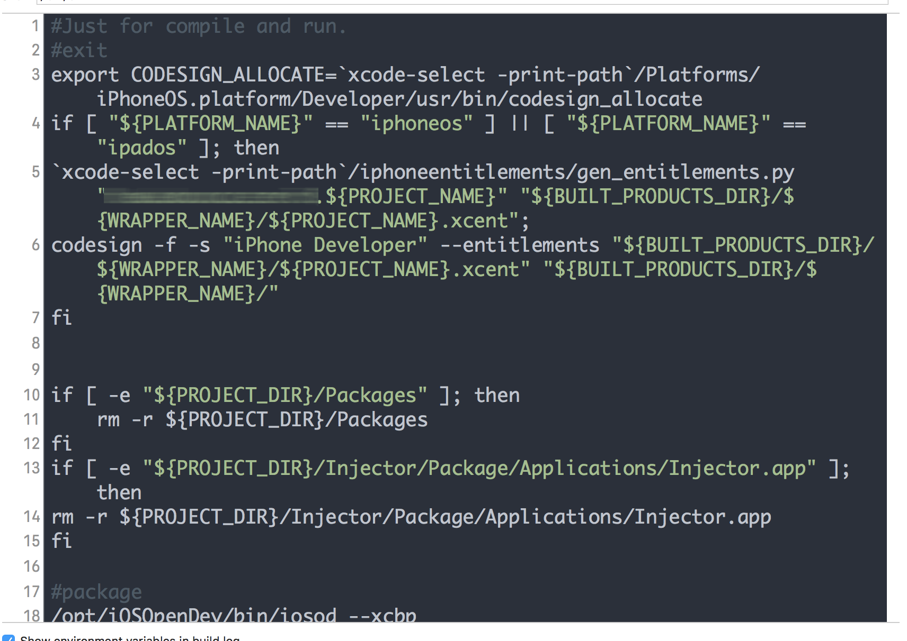

How to Build Injector.md
======

該文件是以新安裝的Xcode開始教學。

The tutorial begin with new installed Xcode.

## Environment
 - OS X 10.11.2
 - Xcode 7.3.1(and Xcode 6.1.1)
 - Homebrew 0.9.9

## Install Xcode command line tool

```
sudo xcode-select --install
```

> [See more](http://qbsuranalang.blogspot.tw/2015/01/xcode.html).

## Sign Xcode EULA

```
sudo xcodebuild -license
```

> [See more](http://qbsuranalang.blogspot.tw/2015/01/xcode.html).

## Install CocoaPods

```
sudo gem install cocoapods
```

> [See more](http://qbsuranalang.blogspot.tw/2015/03/cocoapods.html).

## File and Directory

### 1449067041_mobile_maintenance.ai

APP 圖示。

APP icon.

### App Icon Template [5.0]

APP 圖示樣板。

APP icon template(psd).

### App Icon [Squared]

APP 輸出圖示。

APP output icon.

### Documentation

說明文件。

Documentation.

### Image

在```README.md```內使用的圖片。

Images of ```README.md```.

### InjectorApp

主要APP專案。

Main APP project.

### InjectorDaemon

後台收集封包的Daemon。

Background running daemon.

### InjectorForeground

抓取目前使用的APP訊息。

Current foreground running APP information.

> 因為在同一個程序內抓前台APP資訊會有問題，所以獨立出一個指令工具。

> Because get foreground running APP information in the same process will fetch some wrong information, I separate it.

### InjectorPreferenceLoader

APP```設定```內的Injector。

APP ```Settings``` of Injector.

### InjectorUploader

上傳封包流量訊息。

Upload packet flow information.

### merge.sh

合併所有專案的腳本。

The script of merge all project.

### README.md

就是```README.md```。

Just ```README.md```.

## Install theos

安裝```dpkg```。

Install ```dpkg```.

```
brew install dpkg
```

</br>
新增兩個環境變數到使用者組態檔內。

Add two variable to user profile.

```
export PATH=$PATH:/opt/theos/bin
export THEOS=/opt/theos
```

</br>
安裝theos。

Install theos.

```
sudo git clone --recursive git://github.com/DHowett/theos.git $THEOS
cd $THEOS
sudo cp -R vendor/include/ include/
sudo cp -R vendor/lib/ lib/  
```

> [See more](http://iphonedevwiki.net/index.php/Theos).


## Install iOSOpenDev

安裝```ldid```和```dpkg```。

Install ```ldid``` and ```dpkg```.

```
brew install ldid dpkg
```

</br>
新增兩個環境變數到使用者組態檔內。

Add two variable to user profile.

```
export PATH=$PATH:/opt/theos/bin:/opt/iOSOpenDev/bin
export iOSOpenDevPath=/opt/iOSOpenDev 
```

</br>
安裝iOSOpenDev。

Install iOSOpenDev.

```
git clone --recursive https://github.com/kokoabim/iOSOpenDev.git $iOSOpenDevPath
```

</br>
複製樣板，將在本文件下的目錄```iOSOpenDev```裡，資料夾```templates```複製到目的端。

Copy templates, the folder ```templates``` at the directory ```iOSOpenDev``` right at this file location.

```
chmod -R 755 templates 
sudo cp -r templates $iOSOpenDevPath
mkdir -p ~/Library/Developer/Xcode/Templates/iOSOpenDev
ln -fhs $iOSOpenDevPath/templates ~/Library/Developer/Xcode/Templates/iOSOpenDev
```

</br>
複製檔案，將在本文件下的目錄```iOSOpenDev```裡，資料夾```Specifications1```和```Specifications2```內檔案複製到目的端。

Copy files, the files in folder ```Specifications1``` and ```Specifications2``` at the directory ```iOSOpenDev``` right at this file location.

```
sudo mkdir -p `xcode-select -print-path`/Platforms/iPhoneOS.platform/Developer/Library/Xcode/Specifications/
sudo mkdir -p `xcode-select -print-path`/Platforms/iPhoneSimulator.platform/Developer/Library/Xcode/Specifications/
sudo cp -R Specifications1/ `xcode-select -print-path`/Platforms/iPhoneOS.platform/Developer/Library/Xcode/Specifications/
sudo cp -R Specifications2/ `xcode-select -print-path`/Platforms/iPhoneSimulator.platform/Developer/Library/Xcode/Specifications/
sudo rm -rf `xcode-select -print-path`/Platforms/iPhoneSimulator.platform/Developer/usr
sudo cp -a usr3 `xcode-select -print-path`/Platforms/iPhoneSimulator.platform/Developer/usr
```

</br>
連結指令。

Link command line tool.

```
sudo mkdir -p `xcode-select -print-path`/Platforms/iPhoneOS.platform/Developer/usr/bin
sudo mkdir -p `xcode-select -print-path`/Platforms/iPhoneSimulator.platform/Developer/usr/bin
sudo ln -fhs $iOSOpenDevPath/bin/iosod `xcode-select -print-path`/Platforms/iPhoneOS.platform/Developer/usr/bin
sudo ln -fhs $iOSOpenDevPath/bin/iosod `xcode-select -print-path`/Platforms/iPhoneOS.platform/Developer/usr/bin
sudo ln -fhs $iOSOpenDevPath/bin/ldid `xcode-select -print-path`/Platforms/iPhoneSimulator.platform/Developer/usr/bin
sudo ln -fhs $iOSOpenDevPath/bin/ldid `xcode-select -print-path`/Platforms/iPhoneSimulator.platform/Developer/usr/bin
```

</br>
修改```SDKSettings.plist```，```DefaultPropertie```底下的```CODE_SIGNING_REQUIRED```、```ENTITLEMENTS_REQUIRED```以及```AD_HOC_CODE_SIGNING_ALLOWED```分別改成```NO```、```NO```以及```YES```。

Revise ```SDKSettings.plist```, under the ```DefaultPropertie``` three key: ```CODE_SIGNING_REQUIRED```, ```ENTITLEMENTS_REQUIRED``` and ```AD_HOC_CODE_SIGNING_ALLOWED```, update to each are ```NO```, ```NO``` and ```YES```。

```
ls `xcode-select -print-path`/Platforms/iPhoneOS.platform/Developer/SDKs/iPhoneOS.sdk/SDKSettings.plist
```

> 需要root權限修改文件，可以先複製到桌面修改完後再複製回去目錄。

> You need root privilege to update file. You can copy it to desktop for revise, after that, copy to original location.

</br>
因為在Xocde 7.3之後，iOS 9.3 SDK移除了```Private Framework```，所以除了要從之前的SDK複製出要使用的private framework，還要修改組態檔，```MinimumSDKVersion```值改成```9.2```，同上需要root權限。

In Xcode 7.3, the private framework has been removed from iOS 9.3 SDK. If need it, you need to copy needed private framework from previous SDK. After that you need to update configure file. Key, ```MinimumSDKVersion``` update to ```9.2```. Ditto.

```
ls `xcode-select -print-path`/Platforms/iPhoneOS.platform/Info.plist
```

> 工具內的```Wi-Fi Scanner```使用了private framework，所以可能未來某一版本的iOS就無法使用了。

> Tool, ```Wi-Fi Scanner``` used private framework, maybe someday iOS version cannot be used anymore.

</br>
在本文件下的目錄```iOSOpenDev```裡面的```Installer```內有個指令```iod-setup```輔助安裝。

There is an aid command to install iOSOpenDev in the folder ```Installer``` at the directory ```iOSOpenDev``` right at this file location.

```
sudo mkdir -p `xcode-select -print-path`/Platforms/iPhoneOS.platform/Developer/SDKs/iPhoneOS.sdk/System/Library/PrivateFrameworks
./iod-setup sdk -d `xcode-select -print-path`
```

完成後安裝```iOSOpenDev-1.6-2.pkg```。

Install ```iOSOpenDev-1.6-2.pkg``` when finish it.

</br>
複製剩下的相依文件。

Copy remain dependencies.

```
sudo cp -R $THEOS/vendor/include/ $iOSOpenDevPath/include/
sudo cp -R $THEOS/vendor/lib/ $iOSOpenDevPath/lib/  
```

</br>
如果安裝成功的話，新增Xcode專案時會出現新的Template可以選擇。
If install successfully, when create a new Xcode project, you can see new template for choose.



> 因為Xcode 7後iOSOpenDev並沒有更新，所以安裝上會比較麻煩。

> Because iOSOpenDev is not update after Xcode 7, there is more messy for install.

## Build InjectorApp

複製route.h表頭檔。

copy header route.h.

```
sudo cp /usr/include/net/route.h \
`xcode-select -print-path`/Platforms/iPhoneOS.platform/Developer/SDKs/iPhoneOS.sdk/usr/include/net/route.h
```

</br>
切到```InjectorApp```目錄後，如果沒有```Pods```目錄，指令。

cd to ```InjectorApp```. If there is not directory, ```Pods```, command to install.

```
pod install
```

> ```RNFrostedSidebar```pod專案有改寫過，所以重新pod install後可能會無法編譯。

> Pod project, ```RNFrostedSidebar``` is revised, reinstall may cause not be compiled.

</br>
打開```Injector.xcworkspace```。

Open```Injector.xcworkspace```.

專案設定的General會先Sign identities出錯，所以點選```Fix Issue```修復問題。

Sign identities problem occurs in the general of project settings, just click ```Fix Issue``` to fix.



> 因為Xcode 7之後編譯到實體裝置上已經不需要購買憑證，所以要修復免費的Sign identities。

> After Xcode 7, we don't need to purchase certificate, so just fix "Sign identities" problem.

以防萬一出錯，編譯前先```Product```->```Clean```。

Just in cast, ```Product```->```Clean```.

</br>
編譯成功時，APP執行會提示目前是debug版本。

When compile successfully, running APP show popup to prompt it is debug version.



## Pack InjectorApp

下載並安裝假的entitlements。

Download and install fake entitlements。

```
sudo mkdir -p `xcode-select -print-path`/iphoneentitlements
cd `xcode-select -print-path`/iphoneentitlements
sudo curl -O http://www.alexwhittemore.com/iphone/gen_entitlements.txt
sudo mv gen_entitlements.txt gen_entitlements.py
sudo chmod 777 gen_entitlements.py
```

</br>
專案設定的Build Phases中的Run Script，將第二行的exit拿掉。

The Run Script in Build Phases of project settings, comment "exit" command in line two.



> 該腳本會將原本的Entitlements替換成空的Entitlements，接著再利用iOSOpenDev工具打包。

> The script will replace original entitlements with empty entitlements, then pack it by iOSOpenDev tool.

</br>
打包使用```Product```->```Build For```->```Profiling```。

Pack: ```Product```->```Build For```->```Profiling```.

成功的話在專案目錄中會出現目錄```Packages```。

If success, there is a directory ```Packages``` at project directory.

## Build and pack InjectorDaemon

專案```InjectorDaemon```使用iOSOpenDev的Command line tool template，但是Xcode 7以上無法正常使用，所以安裝Xcode 6.1.1版本，可以在官方網站或[這裡](http://stackoverflow.com/questions/10335747/how-to-download-xcode-4-5-6-7-and-get-the-dmg-file)下載。

Because ```InjectorDaemon``` using template, command line tool of iOSOpenDev, but Xcode 7 or later version occur an unkown problem. We need install Xcode 6.1.1. You can download the version of Xcode at official website or [here](http://stackoverflow.com/questions/10335747/how-to-download-xcode-4-5-6-7-and-get-the-dmg-file).

安裝後先開啟一次，再重新命名成Xcode-6.1.1.app以防萬一搞混。

After installing, open it first. Then rename to ```Xcode-6.1.1.app```.

> 可以同時存在不同版本的Xcode，但需要靠指令切換版本。

> It is allowed exist different versions of Xcode at the same time, but need switch version by command.

</br>
切換版本，以及簽署EULA。

Switch and sign EULA.

```
sudo xcode-select --switch /Applications/Xcode-6.1.1.app/Contents/Developer
sudo xcodebuild -license
```

</br>
安裝```iOSOpenDev-1.6-2.pkg```。

Install ```iOSOpenDev-1.6-2.pkg```.

</br>
打開```InjectorDaemon.xcodeproj```，直接打包```Product```->```Build For```->```Profiling```。

Open```InjectorDaemon.xcodeproj``` and pack ```Product```->```Build For```->```Profiling```.

成功的話在專案目錄中會出現目錄```Packages```。

If success, there is a directory ```Packages``` at project directory.

## Build and pack InjectorForeground

打開```InjectorForeground.xcodeproj```，直接打包```Product```->```Build For```->```Profiling```。

Open```InjectorForeground.xcodeproj``` and pack ```Product```->```Build For```->```Profiling```.

成功的話在專案目錄中會出現目錄```Packages```。

If success, there is a directory ```Packages``` at project directory.

## Build and pack InjectorPreferenceLoader

下載相依的文件，將解壓縮後的資料夾內檔案全部複製到```$iOSOpenDevPath/include/```。

Download dependency and unzip it. Merge all file in extra folder to ```$iOSOpenDevPath/include/```.

```
https://github.com/kennytm/iphone-private-frameworks/tree/master
```

</br>
下載相依的文件。

Download dependency.

```
cd $iOSOpenDevPath/include/IOSurface
sudo curl -O http://keykernel.org/other/IOSurfaceAPI.h
```

</br>
打開```InjectorPreferenceLoader.xcodeproj```，直接打包```Product```->```Build For```->```Profiling```。

Open```InjectorPreferenceLoader.xcodeproj``` and pack ```Product```->```Build For```->```Profiling```.

成功的話在專案目錄中會出現目錄```Packages```。

If success, there is a directory ```Packages``` at project directory.

> 編譯過程中會有幾個重複宣告的錯誤，註解掉就好了。

> There is several duplicate error when compiling, just comment it.

## Build and pack InjectorUploader

打開```InjectorUploader.xcodeproj```，直接打包```Product```->```Build For```->```Profiling```。

Open```InjectorUploader.xcodeproj``` and pack ```Product```->```Build For```->```Profiling```.

成功的話在專案目錄中會出現目錄```Packages```。

If success, there is a directory ```Packages``` at project directory.

## Merge all project

當編譯完```InjectorApp```、```InjectorDaemon```、```InjectorForeground```、```InjectorPreferenceLoader```和```InjectorUploader```五個專案時，使用```merge.sh```合併所有專案。

When compile ```InjectorApp```, ```InjectorDaemon```, ```InjectorForeground```, ```InjectorPreferenceLoader``` and ```InjectorUploader``` is done, run ```merge.sh``` script to merge all project.

```
./merge.sh
```

</br>
完成後的deb檔在```Release/tw.edu.mcu.cce.nrl.Injector_2.1_iphoneos-arm.deb```。

deb file location: ```Release/tw.edu.mcu.cce.nrl.Injector_2.1_iphoneos-arm.deb```.

> 如果中間出現一些錯誤訊息，通常是某一個專案沒有打包成功，重新打包就好。

> If occur some error, usually some project didn't pack successfully, just re-pack.

## Other

其他專案如果沒有修改，只要打包一次就好了。

If some project not update, just pack once.

</br>
如果打包後，安裝時仍有之前debug版本的Injecor，會無法正常安裝。

If still installed debug version of Injector after packing, it cannot be install successfully.

</br>
> damn